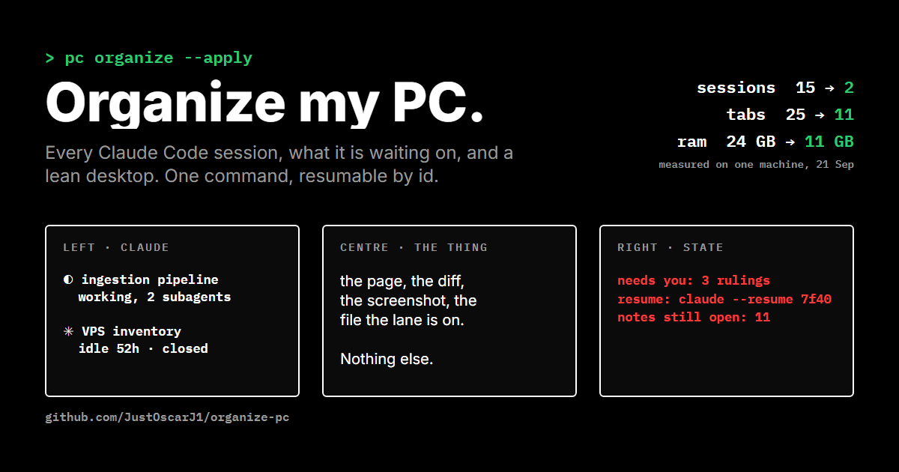

# organize-pc



Come back to a Windows machine covered in Claude Code terminals, Notepad tabs and half-dead dev servers, say "organize my PC", and get back a lean desktop and one page that says what every agent was doing and what it is waiting on.

`pc` is a single Python file. It finds every live Claude Code session, reads its transcript to see the opening ask and the closing report, decides which sessions are done, banks and closes Notepad tabs whose text already went to an agent, closes the apps that are not load-bearing, kills leaked servers, and lays out virtual desktops: Claude on the left monitor, the thing to look at in the centre, the state file on the right.

Closing a session loses nothing. The transcript is the session; `claude --resume <id>` brings it back, and the id is in the state file.

## Install

Windows 11, Python 3.11+.

```
pip install psutil pywin32 comtypes pyvda
git clone https://github.com/JustOscarJ1/organize-pc
cd organize-pc
install.cmd
```

`install.cmd` puts a `pc` launcher in `%USERPROFILE%\.local\bin` and copies the skill to `%USERPROFILE%\.claude\skills\organize-pc` so a Claude Code session can run it on "organize my PC".

## Use

```
pc scan                 what is running, no changes
pc organize             the whole sweep, dry run
pc organize --apply     the whole sweep, armed
pc state                write and print STATE.txt
pc resume <words>       the claude --resume command for a closed lane
pc close --apps --apply only the app list
pc desktops --apply     only the layout
```

State lands in `~/pc`: `STATE.txt`, one file per lane in `lanes/`, every unsaved Notepad tab in `bank/` before anything closes.

## Verdicts

A session is `busy` while its terminal title spins or a subagent transcript was touched in the last ten minutes, `idle` if someone spoke in it in the last six hours, `done` otherwise, `empty` if it never got a transcript. Done and empty are closed.

A Notepad tab is closed when its file is saved on disk, when it is empty, or when its first line appears in a user message of some session. Everything else stays open on the Notes desktop.

Hours, patterns, app lists and monitor names live in `policy.json`. Change the policy, not the code, when a verdict is wrong.

## How it reads the machine

- Session titles come from `AttachConsole` on each `claude.exe`.
- Which transcript belongs to which process is matched by start time.
- Notepad tab text comes from UI Automation; a tab has to be selected and its window on the current desktop to be readable.
- Tabs close with Ctrl+W and the Don't save button, found by name.
- Desktops are managed with pyvda. A new window is born on the current desktop, so the state panes are spawned after switching.

## Licence

MIT.
